Valence is a system that **preserves intent and agency** against the grain of automated gaslighting and cognitive offloading. Intent should flow through to implementation without being lost or distorted. Decisions and rationale are mine to own. The system should flag bullshit requirements, not enable poor life choices. 

This workflow is what survived 2.5k hours of iteration: First Principles + spec-driven + test-driven + atomic tasks, in a grounded multi-agent workflow with formalized quality gates, adversarial reviews and auditable handoffs. 

I dont want a magic button, I just want to know what happens when I can finally work at the speed of thought.

---

## Contents

- [Ideas](#ideas) — Design philosophy
- [Primitives](#primitives) — User-invoked entry points
- [The Workflow](#the-workflow) — Phase diagram
- [Quality Gates](#quality-gates) — Validation checkpoints
- [Grounding & Navigation](#grounding--navigation) — Where agents look and what they trust
- [Meet The Team](#meet-the-team) — Agents, models, infrastructure
- [Filetree](#filetree) — Repository structure
- [Usage](#usage) — Example workflow

---

## Ideas

1. **Code is a Liability; Judgement is an Asset**
Never generate implementation from a raw prompt. Enforce First Principles design to crystallize the solution architecture before a single line of syntax is written. Stress test all assumptions and swap for custom fits. 

2. **Consensus through Dissensus**
Your idea is only as good as the number of bulletholes it can withstand. Deploy Adversarial Review panels to manufacture friction. By forcing distinct models with different training data to critique the same design, you expose blind spots that a single perspective would miss. Trust conflict more than agreement.

3. **Cognitive Tiering**
Intelligence is a finite resource that must be allocated economically. Do not use a supercomputer to write boilerplate, nor a fast model to design architecture. Route tasks based on cognitive load: high-reasoning models for strategy and design, and high-efficiency models for execution and QA. Optimize the curve between cost, speed, and quality per task.

4. **The Spec is the Source of Truth**
Conversation is ephemeral; artifacts are eternal. Never iterate inside the chat window, iterate on the Design Document. Validation is performed against the spec, not the chat. If a requirement isn't in the spec, it doesn't exist.

5. **Context is Noise**
Bigger token windows are a trap. Info-dumping into context dilutes reasoning and increases hallucination. Practice Radical Context Hygiene—prune context to give agents only the narrow, curated signal they need for their specific phase. Read the docs, not the implementation. Less context means higher IQ.

6. **Grounding, not Guessing**
Document everything. Models prioritize plausibility over truth. Force active grounding to invert this. Before recommending a library or pattern, the system must verify it against library documentation, known pitfalls, and project docs. Treat documented reality as a hard constraint that overrides training data.

7. **Deterministic Execution**
Ambiguity is the enemy of automation. A plan is only valid if a worker can execute it without asking clarifying questions. Test cases are defined with the design, not after the build. Break work into atomic tasks with unabiguous acceptance criteria. If the builder has to guess, the planner failed.

8. **Audit the Auditor**
The agent that builds the code cannot be trusted to validate it. Separate the roles of Execution and Validation. Independent agents pattern-match against the design, ensuring that the implementation actually matches the intent. QA agents relitigate the build gates and retest the code in a separate context.

9. **Entropy Control**
AI-generated code defaults to verbosity and repetition. The natural state of a codebase is entropy. Treat Simplification and QA as a distinct post-hoc production phases, running dedicated passes to strip out dead code, redundancy, and noise before they calcify into technical debt.

10. **Agency > Automation**
This system is an exoskeleton, not a replacement. Automation without structure is just faster tech debt. You own the vision, the Quality Gates, and the final say. Execution scales. Judgment doesn't.

---

## Primitives

User-invoked entry points into the workflow. Each command loads its protocol and executes the corresponding phase.

| Command | Purpose | Protocol |
|---------|---------|----------|
| `/arm [thoughts]` | Crystallize Fuzzy ideas — extract reqs, constraints, style, concepts | [SKILL_arm.md](https://github.com/skillsets-cc/main/blob/main/skillsets/%40supercollectible/Valence/content/.claude/skills/arm/SKILL.md) |
| `/design [brief]` | Design a Solution — research, design doc, architecture decisions | [SKILL_design.md](https://github.com/skillsets-cc/main/blob/main/skillsets/%40supercollectible/Valence/content/.claude/skills/design/SKILL.md) |
| `/ar [doc.md]` | Adversarial review — orchestrates ar agents, cost/benefit for human review | [SKILL_ar.md](https://github.com/skillsets-cc/main/blob/main/skillsets/%40supercollectible/Valence/content/.claude/skills/ar/SKILL.md) |
| `/plan [design.md]` | Plan execution — transform design into tasks, acceptance criteria | [SKILL_plan.md](https://github.com/skillsets-cc/main/blob/main/skillsets/%40supercollectible/Valence/content/.claude/skills/plan/SKILL.md) |
| `/build [exec.md]` | Implement a plan — todos, code, tests, cleanup | [SKILL_build.md](https://github.com/skillsets-cc/main/blob/main/skillsets/%40supercollectible/Valence/content/.claude/skills/build/SKILL.md) |
| `/pmatch [source] [target]` | Validate target against source claims | [SKILL_pmatch.md](https://github.com/skillsets-cc/main/blob/main/skillsets/%40supercollectible/Valence/content/.claude/skills/pmatch/SKILL.md) |
| `/denoise [path]` | Post-build cleanup — invokes code-simplifier plugin | [Anthropic plugin](https://github.com/anthropics/claude-plugins-official/tree/main/plugins/code-simplifier) |
| `/qf` `/qb [path]` | QA audit — frontend (design system, a11y) or backend (DI, logging) | [qa-f.md](https://github.com/skillsets-cc/main/blob/main/skillsets/%40supercollectible/Valence/content/.claude/agents/qa-f.md), [qa-b.md](https://github.com/skillsets-cc/main/blob/main/skillsets/%40supercollectible/Valence/content/.claude/agents/qa-b.md) |
| `/qd [path]` | Docs QA — validates and updates documentation | [qa-docs.md](https://github.com/skillsets-cc/main/blob/main/skillsets/%40supercollectible/Valence/content/.claude/agents/qa-docs.md) |
| `/security-review` | Security audit — injection, XSS, auth flaws | [Claude Code native](https://www.anthropic.com/news/automate-security-reviews-with-claude-code) |

---

## The Valence Workflow

```mermaid
%%{init: {'theme': 'dark'}}%%
flowchart LR
    A["💭 Thoughts"] -->|"/arm"| B["📋 Brief"]
    B -->|"/design"| C["📐 Design"]
    C -->|"/ar"| D{"🔍 Review"}
    D -->|approve| E["/plan"]
    D -.->|mitigate| C
    E -->|"/pmatch"| F["/build"]
    F --> G["/denoise → /qf /qb → /qd → /security"]
    G --> H{{"✅ Validated"}}
```



Eight phases, each gated. Feedback loops at design review and build validation. Detail per phase below.

---

### `/arm` — Crystallize

Opus extracts requirements, constraints, style, and key concepts from fuzzy initial thoughts. Proactive QA forces decisions before design begins.

```mermaid
%%{init: {'theme': 'dark'}}%%
flowchart TB
    input(["💭 Initial thoughts"])
    input --> qa["Proactive QA\n(Conversational)"]
    qa -->|iterate| qa
    qa --> decide["Force Decisions\n(AskUserQuestion)"]
    decide --> brief(["📋 brief"])
```



Protocol: [SKILL_arm.md](https://github.com/skillsets-cc/main/blob/main/skillsets/%40supercollectible/Valence/content/.claude/skills/arm/SKILL.md)

---

### `/design` — First Principles Design

Opus deconstructs the brief via first principles while grounding against docs, Context7, and web sources. Iterative discussion loop with the human until approval.

```mermaid
%%{init: {'theme': 'dark'}}%%
flowchart TB
    brief(["📋 brief"])
    brief --> fp["Deconstruct\n(First Principles)"]
    brief --> ground["Grounding\n(Docs · Context7 · Web)"]
    fp & ground --> loop["Discussion Loop\n1. Present Draft\n2. User Feedback\n3. Refine"]
    loop -->|iterate| loop
    loop --> approve{{"✋ User Approval"}}
    approve --> design(["📐 design.md"])
```



Protocol: [SKILL_design.md](https://github.com/skillsets-cc/main/blob/main/skillsets/%40supercollectible/Valence/content/.claude/skills/design/SKILL.md)

---

### `/ar` — Adversarial Review

Three models, same protocol, different blind spots. The value is where they *disagree*. Human decides which critiques warrant design changes.

```mermaid
%%{init: {'theme': 'dark'}}%%
flowchart TB
    design(["📐 design.md"])
    design --> ar_o["ar-o\n🟣 Opus"]
    design --> ar_k["ar-k\n🔵 Kimi"]
    design --> ar_d["ar-d\n🟢 Deepseek"]
    ar_o & ar_k & ar_d --> agg["Aggregate &\nCost/Benefit"]
    agg --> human{{"✋ Human Review"}}
    human -->|Approve| out(["📐 design.md ✅"])
    human -.->|Mitigate| design
```



Each agent independently runs: First Principles Challenge · Internal Consistency · Best Practices (Web + Context7) · Architecture Stress Test · Specification Completeness.

Protocol: [SKILL_ar.md](https://github.com/skillsets-cc/main/blob/main/skillsets/%40supercollectible/Valence/content/.claude/skills/ar/SKILL.md)

---

### `/plan` — Execution Planning

Opus transforms approved design into an execution doc with atomic tasks, agent assignments, acceptance criteria, and exact file paths.


Protocol: [SKILL_plan.md](https://github.com/skillsets-cc/main/blob/main/skillsets/%40supercollectible/Valence/content/.claude/skills/plan/SKILL.md)

---

### `/pmatch` — Pattern Matching Validation

Spec drift is real. Two agents independently extract claims from the source, check if the target satisfies each one, then merge. Consensus on violations is high confidence.

```mermaid
%%{init: {'theme': 'dark'}}%%
flowchart TB
    source(["📐 design.md"]) & target(["📝 execution.md"])
    source & target --> pms["pm-s\n🟠 Sonnet"]
    source & target --> pmk["pm-k\n🔵 Kimi"]
    pms & pmk --> merge["Merge Findings\n(Consensus · Extras)"]
    merge --> out(["📝 execution.md ✅"])
```



Output: list of claims with VALIDATED / VIOLATED / MISSING status, citations to both documents.

Protocol: [SKILL_pmatch.md](https://github.com/skillsets-cc/main/blob/main/skillsets/%40supercollectible/Valence/content/.claude/skills/pmatch/SKILL.md)

---

### `/build` — Parallel Implementation

Opus orchestrates parallel Sonnet build agents, each implementing delegated sections of the execution doc. Post-build `/pmatch` validates implementation against spec.

```mermaid
%%{init: {'theme': 'dark'}}%%
flowchart TB
    exec(["📝 execution.md ✅"])
    exec --> b1["Build 🟠 Sonnet"]
    exec --> b2["Build 🟠 Sonnet"]
    exec --> b3["Build 🟠 Sonnet"]
    b1 & b2 & b3 --> val["/pmatch validation\n(execution ↔ modules)"]
    val --> code(["🔨 Implementation"])
```



Protocols: [SKILL_build.md](https://github.com/skillsets-cc/main/blob/main/skillsets/%40supercollectible/Valence/content/.claude/skills/build/SKILL.md), [AGENT_build.md](https://github.com/skillsets-cc/main/blob/main/skillsets/%40supercollectible/Valence/content/.claude/agents/build.md)

---

### Post-Build Quality Pipeline

Sequential. Order matters — simplify first so pattern auditors don't waste cycles flagging noise that's about to be deleted.

```mermaid
%%{init: {'theme': 'dark'}}%%
flowchart LR
    code(["🔨 Code"])
    code --> dn["/denoise\nDead code\nRedundancy"]
    dn --> qa["/qf · /qb\nPatterns\nA11y · DI"]
    qa --> docs["/qd\nDocs\nFreshness"]
    docs --> sec["/security\nOWASP\nXSS · Auth"]
    sec --> valid{{"✅ Validated"}}
```



| Step | Agent | Scope |
|------|-------|-------|
| `/denoise` | Opus | Dead code, redundancy, type safety, comment cleanup |
| `/qf` `/qb` | Sonnet | Design system, accessibility, DI, logging, error handling |
| `/qd` | Sonnet | ARC files, READMEs match implementation |
| `/security-review` | Native | Injection, XSS, auth flaws, OWASP |

---

## Quality Gates

Eight checkpoints, each blocking forward progress until validation passes. The sequence matters: requirements solidify before design starts, design locks before planning, plans finalize before code. Later gates assume earlier gates passed—QA agents don't re-validate requirements, they trust the design gate caught that.

| Gate | Mechanism | Validates |
|------|-----------|-----------|
| **Brief** | /arm | Requirements, constraints, style, key concepts extracted |
| **Design** | ar-o / ar-k / ar-d | First principles, internal consistency, best practices |
| **Plan** | /pmatch | Plan matches design, complete acceptance criteria |
| **Per-task** | /build workflow | Acceptance criteria, test cases |
| **Code quality** | /denoise | Dead code, comments, redundancy, complexity |
| **Project patterns** | qa-f / qa-b | Design system, DI, logging, accessibility |
| **Documentation** | qa-docs | Docs match implementation |
| **Security** | /security-review | Injection, XSS, auth flaws, OWASP vulnerabilities |

## Grounding & Navigation

Where agents look and what they trust. The hierarchy below is a naming convention—follow it in your project and agents can self-navigate without custom instructions. Trust order: project docs first (they know your constraints), Context7 second (live library docs), web search last (community knowledge, unverified).

### Documentation Hierarchy

Docs serve two roles: navigation and grounding. The naming convention tells agents where to find information; the content defines contracts that implementation must satisfy. When `/build` reads a module README, it learns both what the module does and what constraints it must preserve.

| Level | Location | Contains |
|-------|----------|----------|
| **System** | `ARCHITECTURE_*.md` | Data flow, key patterns, module boundaries |
| **Module** | `README_*.md` (backend), `ARC_*.md` (frontend) | Module purpose, public API, dependencies |
| **File** | `docs_*/*.md` | Per-file implementation details |

**Example**: Task is "Add TTS fallback logic" → Read `app/services/voice/README_voice.md` → Check `docs_voice/fallback_manager.md` for implementation details.

### Patterns & Templates

Grounding artifacts that constrain how work is done. Style guides encode decisions already made—agents reference them instead of re-inventing conventions. Templates enforce structure so artifacts are machine-readable across workflow phases.

| Artifact | Purpose |
|----------|---------|
| [frontend_styleguide.md](https://github.com/skillsets-cc/main/blob/main/skillsets/%40supercollectible/Valence/content/.claude/resources/frontend_styleguide.md) | React, TypeScript, Zustand, Vitest patterns |
| [backend_styleguide.md](https://github.com/skillsets-cc/main/blob/main/skillsets/%40supercollectible/Valence/content/.claude/resources/backend_styleguide.md) | Python, FastAPI, pytest patterns |
| [claude-execution-template.md](https://github.com/skillsets-cc/main/blob/main/skillsets/%40supercollectible/Valence/content/.claude/resources/claude-execution-template.md) | Execution doc structure — `/plan` output readable by `/build` |
| [ARC_doc_template.md](https://github.com/skillsets-cc/main/blob/main/skillsets/%40supercollectible/Valence/content/.claude/resources/ARC_doc_template.md) | Module architecture template — directory structure, data flow, integration |
| [README_module_template.md](https://github.com/skillsets-cc/main/blob/main/skillsets/%40supercollectible/Valence/content/.claude/resources/README_module_template.md) | Module README template — purpose, files, dependencies, patterns |
| [file_doc_template.md](https://github.com/skillsets-cc/main/blob/main/skillsets/%40supercollectible/Valence/content/.claude/resources/file_doc_template.md) | Per-file doc template — classes, functions, data flow, integration points |

### External Sources

Context7 pulls live library documentation via MCP—structured, authoritative, current. Web search pulls community knowledge—blog posts, GitHub issues, Stack Overflow. Different failure modes: Context7 may lack coverage for niche libraries; web search may surface outdated or incorrect advice. Use both, weight Context7 higher.

| Source | When | What You Get |
|--------|------|--------------|
| **Context7** | New external dependencies | Live library docs via `mcp__context7__resolve-library-id()` |
| **Web Search** | Technology decisions | Recent gotchas, breaking changes, community consensus |

Context7 is *required* for any library not already validated in the codebase. Web search fills gaps—especially useful for "has anyone else hit this?" questions.

---

## Meet The Team

The roster. Which agent runs on which model, what each one does, and the infrastructure that connects them.

### Model Selection

The cost curve: Opus is expensive but catches design flaws that compound downstream. A missed edge case in design costs more to fix in planning, more again in implementation, most in production. Sonnet is the workhorse—fast enough for iteration, capable enough for implementation. Haiku handles throwaway tasks where speed matters more than depth.

| Agent | Model | Purpose | Protocol |
|-------|-------|---------|----------|
| `arm` | Opus | Crystallize initial thoughts — extract reqs, constraints, style, concepts | [SKILL_arm.md](https://github.com/skillsets-cc/main/blob/main/skillsets/%40supercollectible/Valence/content/.claude/skills/arm/SKILL.md) |
| `design` | Opus | Design a feature — research, design doc, architecture decisions | [SKILL_design.md](https://github.com/skillsets-cc/main/blob/main/skillsets/%40supercollectible/Valence/content/.claude/skills/design/SKILL.md) |
| `plan` | Opus | Plan execution — transform design into tasks, acceptance criteria | [SKILL_plan.md](https://github.com/skillsets-cc/main/blob/main/skillsets/%40supercollectible/Valence/content/.claude/skills/plan/SKILL.md) |
| `build` | Sonnet | Implement a plan — todos, code, tests, cleanup | [SKILL_build.md](https://github.com/skillsets-cc/main/blob/main/skillsets/%40supercollectible/Valence/content/.claude/skills/build/SKILL.md), [AGENT_build.md](https://github.com/skillsets-cc/main/blob/main/skillsets/%40supercollectible/Valence/content/.claude/agents/build.md) |
| `explore` | Haiku | Lightweight reader and information gatherer supporting Opus | CC native |

### Adversarial Review

Three models, same protocol, different blind spots. The value isn't any single critique—it's where they *disagree*. When Opus flags an edge case that Kimi missed, or Deepseek questions an assumption both others accepted, that's signal. Unanimous approval means either the design is solid or all three share a blind spot.

| Agent | Model | Strength |
|-------|-------|----------|
| `ar-o` | Opus | Exhaustive edge cases, deep assumption chains |
| `ar-k` | Kimi | Broad knowledge base, fast pattern recognition |
| `ar-d` | Deepseek | Alternative training distribution, cost-effective |

The orchestrator aggregates findings, deduplicates overlapping critiques, and presents cost/benefit recommendations. Human decides which critiques warrant design changes.

### Pattern Matching

Spec drift is real. The design says one thing; the code does another. Pattern matching makes this mechanical: extract claims from the spec ("the system SHALL do X"), check if the implementation satisfies each claim. Not "is the code good?" but "does it match the contract?" Two agents extract independently, then merge—consensus on violations is high confidence.

| Agent | Model | Protocol |
|-------|-------|----------|
| `pm-s` | Sonnet | [SKILL_pmatch.md](https://github.com/skillsets-cc/main/blob/main/skillsets/%40supercollectible/Valence/content/.claude/skills/pmatch/SKILL.md) |
| `pm-k` | Kimi | [SKILL_pmatch.md](https://github.com/skillsets-cc/main/blob/main/skillsets/%40supercollectible/Valence/content/.claude/skills/pmatch/SKILL.md) |

Output: list of claims with VALIDATED/VIOLATED/MISSING status, citations to both documents.

### QA Agents

Separated by scope: `code-simplifier` handles universal cleanup (any codebase, any language), `qa-f`/`qa-b` handle project-specific patterns (your design system, your DI conventions), `qa-docs` maintains the documentation hierarchy, `security-review` scans for vulnerabilities. Order matters—simplify first so the pattern auditors don't waste cycles flagging noise that's about to be deleted.

| Agent | Model | Scope | Protocol |
|-------|-------|-------|----------|
| `code-simplifier` | Opus | Dead code, redundancy, type safety, comment cleanup | [Anthropic plugin](https://github.com/anthropics/claude-plugins-official/tree/main/plugins/code-simplifier) |
| `qa-f` | Sonnet | Design system compliance, accessibility, resource cleanup | [qa-f.md](https://github.com/skillsets-cc/main/blob/main/skillsets/%40supercollectible/Valence/content/.claude/agents/qa-f.md) |
| `qa-b` | Sonnet | DI patterns, logging, error handling, backwards compat | [qa-b.md](https://github.com/skillsets-cc/main/blob/main/skillsets/%40supercollectible/Valence/content/.claude/agents/qa-b.md) |
| `qa-docs` | Sonnet | Doc freshness — ARC files, READMEs match implementation | [qa-docs.md](https://github.com/skillsets-cc/main/blob/main/skillsets/%40supercollectible/Valence/content/.claude/agents/qa-docs.md) |
| `security-review` | — | Injection, XSS, auth flaws, OWASP vulnerabilities | [Claude Code native](https://www.anthropic.com/news/automate-security-reviews-with-claude-code) |

Run `/denoise` first, then `/qf` or `/qb`, then `/qd`, then `/security-review`.

### Orchestration

Multi-agent skills (`/ar`, `/build`, `/pmatch`) use Claude Code's agent teams to coordinate parallel work. The lead agent creates a team, spawns teammates, assigns tasks via a shared task list, and monitors progress — it doesn't do the work itself.

**Requirements**:
- `tmux` installed — each teammate runs in its own tmux pane with its own permission prompt
- `CLAUDE_CODE_EXPERIMENTAL_AGENT_TEAMS=1` in environment or `.claude/settings.local.json`

**How it works**:

```
Lead (Opus)
├── TeamCreate          → creates shared team + task list
├── TaskCreate (×N)     → one task per teammate
├── Task (×N)           → spawns teammates in parallel (each gets own terminal)
├── Monitor             → watches task list, handles messages from teammates
├── SendMessage         → coordinates, unblocks stuck teammates
└── Cleanup             → shutdown teammates, delete team
```

Each teammate receives a prompt pointing at the work artifact (design doc, execution doc, source/target paths), reads it directly, does its work, marks its task completed, and messages the lead. Teammates can also discover each other via the team config and coordinate peer-to-peer when needed.

**Lead enters delegate mode** (Shift+Tab) after spawning — this restricts the lead to coordination-only tools (spawn, message, task management) so it doesn't accidentally write code that conflicts with teammates.

**Which skills use teams**:

| Skill | Teammates | Pattern |
|-------|-----------|---------|
| `/ar` | ar-o, ar-k, ar-d | All parallel → aggregate findings |
| `/build` | build (×N) | Parallel or sequenced by dependency → validate |
| `/pmatch` | pm-s, pm-k | All parallel → merge consensus |

Simpler skills (`/denoise`, `/qf`, `/qb`, `/qd`) dispatch a single agent directly via the Task tool — no team overhead needed.

### Multi-Model Infrastructure

Adversarial review and pattern matching require access to models outside Claude. A LiteLLM proxy routes requests and provides MCP tool access to external agents.

**Architecture**:
```
Claude Code (Opus) ──► LiteLLM Proxy ──┬──► Kimi (ar-k, pm-k)
                                       ├──► Deepseek (ar-d)
                                       ├──► Context7 MCP (library docs)
                                       └──► Filesystem MCP (codebase access)
```

**Models available**:

| Model | Agent | Purpose |
|-------|-------|---------|
| `moonshot/kimi-k2.5` | ar-k, pm-k | Broad knowledge, fast pattern recognition |
| `deepseek/deepseek-reasoner` | ar-d | Strong reasoning, alternative perspective |

**MCP integration**: External agents get two MCP servers:
- **Context7**: Library documentation via `resolve-library-id` and `query-docs`
- **Filesystem**: Read-only codebase access via `read_text_file`, `search_files`, `list_directory`, `directory_tree`

This gives ar-k and ar-d the same grounding capabilities as ar-o—they can explore architecture docs, module READMEs, and existing code independently.

**Setup**:
```bash
cd docker/litellm
cp .env.example .env  # Add KIMI_API_KEY, DEEPSEEK_API_KEY, CONTEXT7_API_KEY
docker-compose up -d
```

---

## Filetree

```
your-project/
├── CLAUDE.md                      # Always in context — product vision, toolkit, architecture
└── .claude/                       # Active protocols (what Claude Code uses)
    ├── skills/                    # Skills (slash commands + full protocols)
    │   ├── arm/SKILL.md           # /arm → crystallization workflow
    │   ├── design/SKILL.md        # /design → design workflow
    │   ├── plan/SKILL.md          # /plan → execution planning workflow
    │   ├── ar/SKILL.md            # /ar → adversarial review orchestration
    │   ├── build/SKILL.md         # /build → implementation workflow
    │   ├── denoise/SKILL.md       # /denoise → code-simplifier plugin
    │   ├── pmatch/SKILL.md        # /pmatch → pattern matching validation
    │   ├── qf/SKILL.md            # /qf → frontend QA agent
    │   ├── qb/SKILL.md            # /qb → backend QA agent
    │   ├── qd/SKILL.md            # /qd → docs QA agent
    │   └── [your-skill]/          # Add domain skills here
    │
    ├── agents/                    # Sub-agents (autonomous tasks)
    │   ├── build.md               # Build worker (Sonnet)
    │   ├── qa-docs.md             # Documentation freshness validator
    │   ├── qa-f.md                # Frontend module audit
    │   ├── qa-b.md                # Backend module audit
    │   ├── ar-o.md                # Adversarial review (Opus)
    │   ├── ar-k.md                # Adversarial review (Kimi via LiteLLM)
    │   ├── ar-d.md                # Adversarial review (Deepseek via LiteLLM)
    │   ├── pm-s.md                # Pattern matching (Sonnet)
    │   └── pm-k.md                # Pattern matching (Kimi via LiteLLM)
    │
    └── resources/                 # Shared resources (style guides, templates)
        ├── frontend_styleguide.md
        ├── backend_styleguide.md
        ├── claude-execution-template.md
        ├── ARC_doc_template.md
        ├── README_module_template.md
        └── file_doc_template.md
```

---

## Usage

A complete feature lifecycle. In practice, you skip or repeat phases based on complexity and review feedback.

```bash
# Crystallize initial thoughts into a brief
/arm I want to add some kind of rate limiting to prevent abuse

# Design from the refined brief
/design Add rate limiting to WebSocket connections with per-session tracking...

# Review the design (orchestrated adversarial review)
/ar designs/rate-limiting-design.md

# Create execution plan from approved design
/plan designs/rate-limiting-design.md

# Implement the approved plan
/build execution/rate-limiting-execution.md

# Simplify the code (general quality)
/denoise frontend/src/core/protocol
/denoise backend/app/core/websocket

# Audit project patterns (after simplification)
/qf frontend/src/core/protocol
/qb backend/app/core/websocket

# Update documentation
/qd frontend/src/core/protocol
/qd backend/app/core/websocket
```

---

## License

[CC BY-SA 4.0](https://creativecommons.org/licenses/by-sa/4.0/)